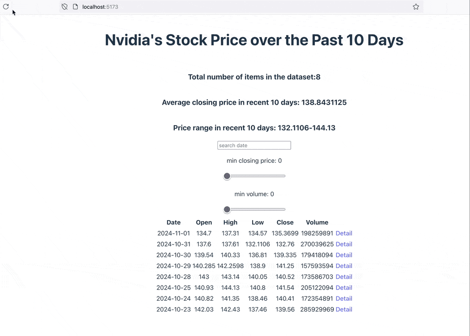

# Web Development Project - _Nvidia Stock_

Submitted by: **Steven Hsiao**

This web app: **Nvidia's stock price over the past 10 days from the marketstack API**

## Features

The following features are implemented:

- The site displays a list of data fetched using an API call, using the useEffect React hook and async/await syntax
- The app dashboard includes three summary statistics about the data, such as: the total number of items in the dataset, the mean, and ranges of the data
- A search bar allows the user to search for an item in the fetched data
- Multiple different filters allow the user to filter items in the database by specified categories
- Each detail view of an item has a direct, unique link to that item’s detail view page

## Video Walkthrough

Here's a walkthrough of implemented user stories:

<!-- Replace this with whatever GIF tool you used! -->

GIF created with Gifski

<!-- Recommended tools:
[Kap](https://getkap.co/) for macOS
[ScreenToGif](https://www.screentogif.com/) for Windows
[peek](https://github.com/phw/peek) for Linux. -->

## License

    Copyright [2024] [Steven Hsiao]

    Licensed under the Apache License, Version 2.0 (the "License");
    you may not use this file except in compliance with the License.
    You may obtain a copy of the License at

        http://www.apache.org/licenses/LICENSE-2.0

    Unless required by applicable law or agreed to in writing, software
    distributed under the License is distributed on an "AS IS" BASIS,
    WITHOUT WARRANTIES OR CONDITIONS OF ANY KIND, either express or implied.
    See the License for the specific language governing permissions and
    limitations under the License.
